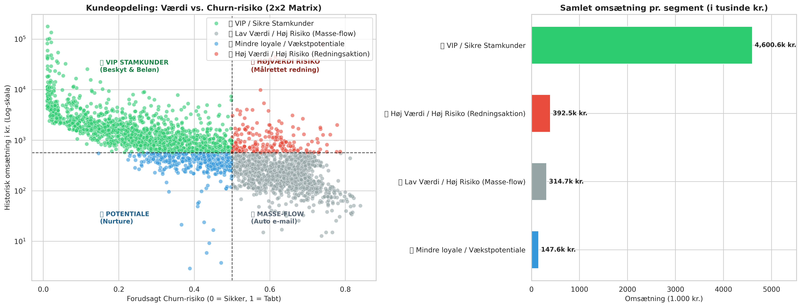

# 1. Teksten til den komplette README
b = "```"  # Hjælpevariabel så koden ikke driller i chatten

readme_tekst = f"""# 🛒 E-Commerce Churn Sentinel: Fra SQL Feature Engineering til Machine Learning

[](https://colab.research.google.com/)

En end-to-end forretningsanalyse og machine learning-pipeline, der forvandler over en halv million rå e-handelstransaktioner til operationelle forretningsindsigter. 

Projektet anvender **in-memory SQL (DuckDB)** til at aggregere og feature-engine rå ordrelinjer uden data leakage, træner en **Random Forest-klassifikationsmodel** til at forudsige churn, og inddeler kundebasen i en **2x2 handlingsmatrix** baseret på omsætning på spil (*Revenue at Risk*).

---

## 📌 Forretningsproblem & Værditilbud

I detail- og e-handelsbranchen koster det 5–7 gange mere at akkverve en ny kunde end at genaktivere en eksisterende. Virksomheder mangler ofte et datadrevet beredskab til at identificere tabte kunder, før de forsvinder endeligt.

**Mål:**
1. Konstruere en tidsopdelt SQL-pipeline, der udleder RFM-adfærd (Recency, Frequency, Monetary value) uden fremtidsforurening (data leakage).
2. Træne en model, der beregner churn-sandsynlighed på kundeniveau.
3. Kvantificere den reelle omsætning i fare og prioritere fastholdelsesindsatser, så marketingbudgettet allokeres optimalt.

---

## 🏗️ Datapipeline & Arkitektur

{b}text
[500.000+ Rå Transaktioner]
          │
          ▼  (DuckDB SQL CTEs: Observations- vs. Forudsigelsesvindue)
[Aggregerede Kundeprofiler: RFM, Livstidslængde, Kurvstørrelse]
          │
          ▼  (Scikit-Learn: Stratified 80/20 Train/Test Split)
[Random Forest Classifier: 100 estimatortræer, dybde 6]
          │
          ▼  (Forretningssegmentering: Medianværdi vs. 50% Risiko)
[Beslutningsmatrix: Revenue at Risk & Målrettet Aktion]
{b}

### Eliminering af Data Leakage via Skæringsdato (Cutoff)
Modellen undgår klassiske metodiske fejl ved at opdele datasættet i to separate tidszoner:
* **Observationsperiode (Fortid):** De første 9 måneder bruges til at udlede kundernes historiske adfærd (total_orders, total_spent, recency_days, customer_lifespan_days).
* **Forudsigelsesperiode (Fremtid):** De sidste 90 dage bruges udelukkende til at observere, om kunden faktisk handlede (churn = 0) eller udeblev (churn = 1).

---

## 🛠️ Feature Engineering i DuckDB SQL

Aggregeringen fra ustrukturerede ordrelinjer til kundeprofiler blev udført direkte i RAM via **DuckDB**:

{b}sql
WITH observation_period AS (
    SELECT 
        CustomerID,
        COUNT(DISTINCT InvoiceNo) AS total_orders,
        SUM(TotalAmount) AS total_spent,
        AVG(TotalAmount) AS avg_order_item_value,
        SUM(Quantity) AS total_items_bought,
        DATE_DIFF('day', MAX(InvoiceDate), CAST('2011-09-10' AS TIMESTAMP)) AS recency_days,
        DATE_DIFF('day', MIN(InvoiceDate), MAX(InvoiceDate)) AS customer_lifespan_days
    FROM df_transactions
    WHERE InvoiceDate < CAST('2011-09-10' AS TIMESTAMP)
    GROUP BY CustomerID
),
prediction_period AS (
    SELECT DISTINCT CustomerID, 1 AS bought_in_future
    FROM df_transactions
    WHERE InvoiceDate >= CAST('2011-09-10' AS TIMESTAMP)
)
SELECT 
    obs.*,
    CASE WHEN pred.bought_in_future IS NULL THEN 1 ELSE 0 END AS churn
FROM observation_period obs
LEFT JOIN prediction_period pred ON obs.CustomerID = pred.CustomerID;
{b}

---

## 📈 Model Performance & Feature Importance



### Model Evaluering (Testdata)
* **ROC-AUC Score:** 0.751 (Solid skelneevne på ustrukturerede forbrugerdata)
* **Nøjagtighed (Accuracy):** 68%
* **Precision / Recall (Churn-klasse):** 0.62 / 0.64 (Fanger 64% af alle reelle churners)

### Hvad driver kundeafgang? (Feature Importance)
1. **customer_lifespan_days (~0,225):** Tiden mellem første og seneste køb er den stærkeste indikator. Kunder med kort historik udviser markant højere churn.
2. **total_orders (~0,205):** Købsfrekvens trumfer samlet forbrug. Regelmæssig interaktion er et stærkere loyalitetstegn end store enkeltkøb.
3. **total_spent & total_items_bought (~0,165):** Kundens samlede monetære volumen.
4. **recency_days (~0,140):** Dage siden sidste interaktion ved cutoff.

---

## 💼 Forretningsmatrix: Revenue at Risk

Ved at koble modellens sandsynlighedsscore med kundens samlede historiske værdi (median = 380 kr.) inddeles basen i fire handlingsorienterede segmenter:

| Segment | Kunder | Andel | Samlet omsætning | Gns. pr. kunde | Gns. inaktivitet | Forretningsindsats |
| :--- | :---: | :---: | :---: | :---: | :---: | :--- |
| ⭐ VIP Stamkunder | 1.476 | 43,8% | ~4.600.000 kr. | 3.117 kr. | 48 dage | Fasthold med loyalitetsprogram og early access. |
| 🚨 Høj Værdi / Høj Risiko | 209 | 6,2% | ~392.500 kr. | 1.878 kr. | 144 dage | Fokusgruppe: Målrettet outreach, personlig rabat. |
| 📉 Lav Værdi / Høj Risiko | 1.297 | 38,5% | ~314.700 kr. | 243 kr. | 152 dage | Automatiserede, omkostningsfrie 'Vi savner dig'-mails. |
| 🌱 Vækstpotentiale | 388 | 11,5% | ~147.600 kr. | 380 kr. | 57 dage | Nurture-kampagner til opsalg/krydssalg. |

### Hovedkonklusion
* **209 redder mere end 1.300:** De 209 højrisiko-storkunder repræsenterer alene ~392.500 kr. i historisk omsætning – mere end de resterende 1.297 lavværdikunder tilsammen (~314.700 kr.).
* **Fokusér ressourcerne:** En marketingafdeling med begrænset budget bør udelukkende sætte ind overfor de 209 kunder. Reddes blot 15% af disse, sikres ~60.000 kr. i fremtidig omsætning.

---

## 📂 Filstruktur

{b}text
├── ecommerce_churn_pipeline.ipynb   # Komplet Python/SQL/ML workflow
├── churn_customer_matrix.png        # 2x2 Matrix & Omsætningsvisualisering
└── README.md                        # Projektdokumentation og konklusioner
{b}

## 🚀 Kørsel

Projektet kan afvikles direkte i Google Colab eller lokalt:

{b}bash
git clone [https://github.com/DIT-BRUGERNAVN/ecommerce-churn-prediction-sql-ml.git](https://github.com/DIT-BRUGERNAVN/ecommerce-churn-prediction-sql-ml.git)
cd ecommerce-churn-prediction-sql-ml
pip install pandas duckdb numpy matplotlib seaborn scikit-learn
{b}
"""
